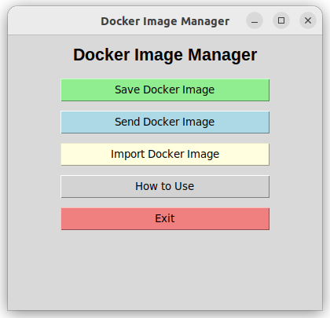

# Docker Image Management Script

This Bash script is designed to simplify the management of Docker images and their transfer between servers. It allows you to build, save, transfer, and import Docker images to local servers or Kubernetes (K8s) clusters.

## Features

The script provides an interactive menu with the following options:

1. **Save Image as a TAR File**  
   Build a Docker image and save it as a `.tar` file.

2. **Send TAR File to Servers**  
   Transfer a `.tar` Docker image file to one or more remote servers.

3. **Import TAR on Server**  
   Import `.tar` files to a Kubernetes cluster (K8s) or other servers. **(Under development)**

4. **Exit**  
   Exit the script.

5. **About**  
   Display information about the script.

## Prerequisites

- **Docker**: Docker must be installed and configured on your system.
- **SSH Access**: SSH access to the target servers is required.
- **Kubernetes (optional)**: If you wish to import images to a Kubernetes cluster, `kubectl` must be configured and you need access to the cluster.

## How to Use

1. **Clone or download the script** to your local system.

2. **Make the script executable**:
    ```bash
    chmod +x deploy_images.sh
    ```

3. **Run the script**:
    ```bash
    ./deploy_images.sh
    ```

4. The interactive menu will be displayed. Select the desired option by entering the corresponding number.

### Example Flow:

- Choose "1" to save a Docker image.
- Provide the name of the Docker image to create and the directory where the `.tar` file will be saved.
- Choose "2" to send the `.tar` file to remote servers.
- Enter the IP addresses or hostnames of the target server(s).
- If you need to import the `.tar` file into a Kubernetes cluster, choose option "3" and follow the instructions.


## Script Structure

The script follows these steps:

1. **Build the Docker Image**: Uses the `docker build` command to create the image from a `Dockerfile`.
2. **Save the Image**: Uses the `docker save` command to create a `.tar` file from the image.
3. **Send to Servers**: Transfers the `.tar` file to remote servers using `scp` or another protocol of your choice.
4. **Import into Kubernetes**: If needed, uses `kubectl` to import the image into a Kubernetes cluster.

## Dependencies

- **Docker**: Ensure Docker is installed and running on your system.
- **SCP**: To transfer files using `scp`, you need SSH access to the target servers.
- **Kubectl**: To import images into a Kubernetes cluster.

## Example Command to Build and Save an Image

```bash
docker build -t my-image:v1 .
docker save -o my-image-v1.tar my-image:v1


## Extra: deploy_image.py
An additional file, deploy_image.py, is currently in development with a graphical user interface (GUI) to assist new Docker users in saving their images. This will provide a more user-friendly experience compared to the command-line interface.

- to run: python deploy_image.py


------------------------------------------Welcome-------------------------------------------------------------- 
 "   #####   ####      #####   ######   ##   ##           #####    #######  ######   ####      #####   ##  ## ";
 "  ##   ##   ##      ##   ##  # ## #   ##   ##            ## ##    ##   #   ##  ##   ##      ##   ##  ##  ## ";
 "  #         ##      ##   ##    ##     ##   ##            ##  ##   ## #     ##  ##   ##      ##   ##  ##  ## ";
 "   #####    ##      ##   ##    ##     #######            ##  ##   ####     #####    ##      ##   ##   #### ";
 "       ##   ##   #  ##   ##    ##     ##   ##            ##  ##   ## #     ##       ##   #  ##   ##    ## ";
 "  ##   ##   ##  ##  ##   ##    ##     ##   ##            ## ##    ##   #   ##       ##  ##  ##   ##    ## ";
 "   #####   #######   #####    ####    ##   ##           #####    #######  ####     #######   #####    #### ";
